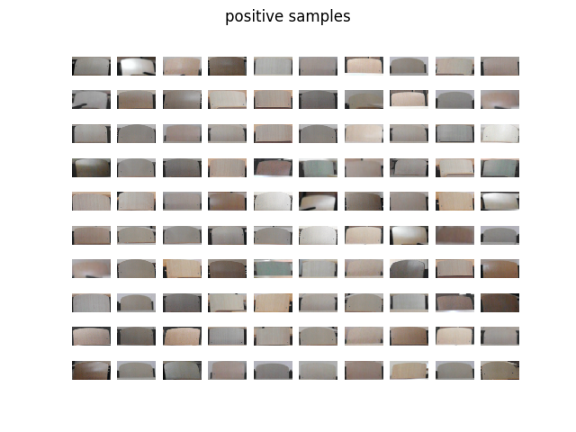
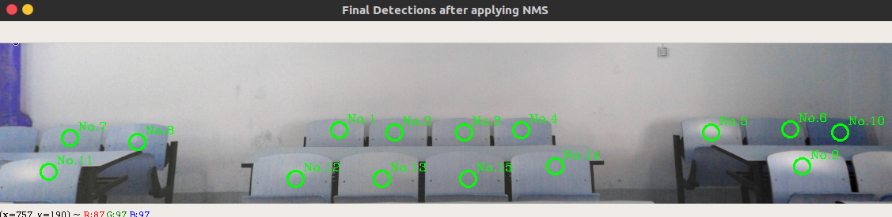

## 教室座位感知
实现教室内座位的自动识别和标注，基于openCV和python 3.5

## 数据
数据打包压缩在`data.z01`、`data.z02`、`data.z03`分卷中，解压可得到`data`文件夹。

## 数据处理
+ `code/process-raw-data.py`将`data/raw-data`中的初始数据通过人工选取的方式进行正负样本采集。在正样本采集中，用鼠标左键拖取选框框出正样本内容。建议正样本完全充满选框，单击鼠标右键取消；负样本采集则是程序随机选取区域，右键保存。
+ `code/resize.py`可将正负样本数据库中的样本缩放到指定大小。
+ `code/data-augmentation.py`进行数据扩大。这里只实现镜面对称，即扩大两倍。

## 程序运行
运行`code/main.py`，进行hog特征抽取、模型训练和保存，以及模型最终验证。可以使用`data/test`的正负样本验证集验证，也可以用`data/test/raw`中教室场景验证。程序可实现座位标注和识别。

## 算法
移植SVM+HOG的经典行人检测算法。大量代码借鉴[bikz/object-detector](https://github.com/bikz05/object-detector)，致谢。
